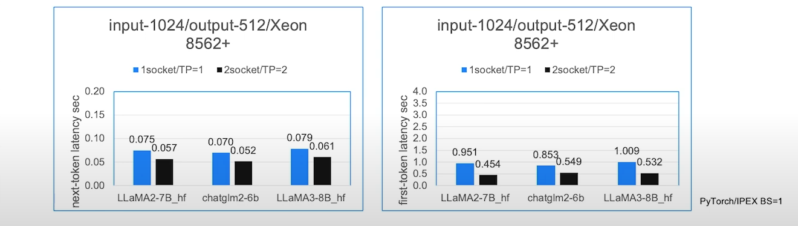

# Xu's AI Newsletter Nov 23, 2024
## Alternatives to NVidia GPUs to run AI inference workloads
Today, we will go over some alternatives to expensive Nvidia GPUs to run AI inferencing. 
### Google
Google introduced TPU (Tensor Processing Unit) in 2016 and was specifically designed for Tensorflow framework (source: https://en.wikipedia.org/wiki/Tensor_Processing_Unit). With rise of LLM and widespread adoption of PyTorch, Nvidia became the dominant force in tensor (matrix) computing platform. In last two years, Google has made significant investments into TPU to compete with Nvidia GPUs. Last year, Google released TPU v5p which has 95 GB HBM (High bandwidth memory) and 2765 GB/s memory bandwidth, which has higher specification for memory and bandwidth than A100-80G. Google also recently released sixth-generation TPU, Trillium now available in preview. 

TPU is XLA (Accelerated Linear Algebra) devices. So you need framework that supports XLA. In addition to Tensflow, PyTorch also has XLA support added in 2018. With XLA 2.0 release last year, PyTorch now has significantly improved inference speed (average ~2x) for XLA devices. [https://pytorch.org/blog/pytorch-2.0-xla/]

Customers can use Jetstream model server to serve LLM model on TPUs. [https://cloud.google.com/kubernetes-engine/docs/tutorials/serve-llm-tpu-jetstream-pytorch] Alternatively, customers can also use vLLM model server [https://cloud.google.com/kubernetes-engine/docs/tutorials/serve-vllm-tpu]

Performance: 

Source: https://pytorch.org/blog/high-performance-llama-2/

Source: https://cloud.google.com/blog/products/compute/trillium-sixth-generation-tpu-is-in-preview

### AMD
AMD is traditionally competing with Nvidia in GPU space. The company was missing out on initial AI training and inference due to lack of tensor software support for their GPU chips. PyTorch eventually added the ROCm backend in 2021. [https://pytorch.org/blog/pytorch-for-amd-rocm-platform-now-available-as-python-package/]

Since then, AMD has released Instinct MI300 series which are powerful accelerators. The top of the line is MI300X which has 192GB HBM3 memory with upto 5.3TB/s memory bandwidth. These specs are better than H100-80GB SXM which costs lot more. 

Customers can use vLLM to serve LLM on AMD Accelerators [https://rocm.blogs.amd.com/artificial-intelligence/vllm/README.html]

Performance:

Source: https://valohai.com/blog/amd-gpu-performance-for-llm-inference/

### Intel
Intel is also playing catch up games in AI space. The company's strategy is to add more softwre tooling to CPU stack especially Xeon series for AI inferencing space while developing viable AI chips such as Gaudi AI accelerator which is intended for training workload [https://www.intel.com/content/www/us/en/products/details/processors/ai-accelerators/gaudi-overview.html]

For AI inferencing, Intel has released Intel Extension for PyTorch which is an open source library extending PyTorch with optimizations for an extra performance boost on Intel hardware to take advantage of hardware capabilities like:

- Intel® Advanced Vector Extensions 512 (Intel® AVX-512)
- Vector Neural Network Instructions (VNNI)
- Intel® Advanced Matrix Extensions (Intel® AMX) on Intel CPUs
- Intel® Xe Matrix Extensions (Intel® XMX) AI engines on Intel discrete GPUs.

Starting with v2.2.0, Intel Extension for PyTorch provides comprehensive feature support and optimization for the LLM domain through its dedicated module called ipex.llm. On the operator level, the extension provides an efficient GEMM kernel to speed up the linear layer and customized operators to reduce the memory footprint. To better trade off the performance and accuracy, different low-precision solutions—such as SmoothQuant and weight-only-quantization—are also enabled, which allows the extension to support datatypes that include FP32, BF16, SmoothQuant for int8, and weight-only quantization for int8 and int4 (experimental). Typical key technical points like paged attention, ROPE fusion, and Tensor Parallelism are included to boost the performance for LLMs. 

Performance Benchmark on Intel Xeon processor running 7B/8B model

Source: Intel

As one can see, the 70-80ms inter token (TBT) latency is acceptable but first token (TTFT) latency of 1 second may be too high for most production use cases. However, if customers are not too strigent on TTFT latency and use cases are either for batch or streaming, using Intel Xeon processor could be an option for smaller models with size of 8B or below. 

If customers are using disaggretion between prefill and decode, it is potentially possible to run prefill stages on GPU and decoding stage on Xeon processor. This will bring down the TTFT latency with acceptable TBT latency while keeping the inferencing cost low. 
